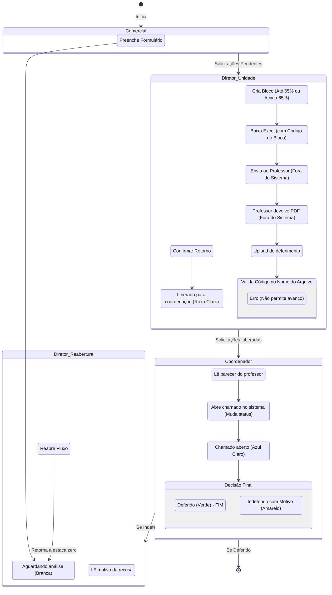

# Documentação Completa: Sistema de Gestão de Descontos Acadêmicos

## Visão Geral
O Sistema de Gestão de Descontos Acadêmicos é uma aplicação web desenvolvida para orquestrar o fluxo de solicitação, aprovação e registro de descontos para alunos. O sistema elimina fluxos baseados puramente em planilhas soltas e e-mails não rastreáveis, fornecendo uma plataforma centralizada.

## Perfis de Usuários
O sistema opera baseado em 4 papéis estritos:
1.  **Comercial**: Responsável por iniciar o processo (Input de dados do aluno e desconto solicitado).
2.  **Diretor de Unidade**: Responsável por agrupar as solicitações em blocos, exportar para o Professor validar (externamente) e fazer o upload do retorno, liberando o processo para a próxima fase.
3.  **Coordenador**: Avalia o retorno do Professor (via PDF), abre chamados formais e toma a decisão final (Deferir/Indeferir).
4.  **Administrador**: Acesso total para gestão técnica e controle de usuários/perfis.

## Diagrama de Fluxo Principal

## Arquitetura Técnica
- **Frontend**: React 18+ com Vite, JS puro, Tailwind CSS.
- **Backend/Banco**: Supabase (PostgreSQL).
- **Autenticação**: Clerk (Tokens JWT integrados ao Supabase via Custom Claims/RLS).
- **Armazenamento de Arquivos**: Supabase Storage (Bucket público para leitura de PDFs autenticada).
- **Tratamento de Arquivos Locais**: `xlsx` para gerar as planilhas para o diretor.

## Padrão de Cores de Status
- **Aguardando análise**: bg-white (Branca)
- **Liberado para coordenação**: bg-purple-100 (Roxo Claro)
- **Chamado aberto**: bg-blue-100 (Azul Claro)
- **Deferido**: bg-green-100 (Verde)
- **Indeferido**: bg-yellow-100 (Amarela)
